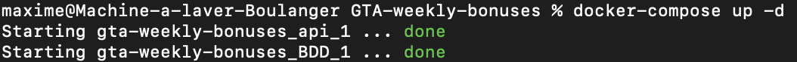
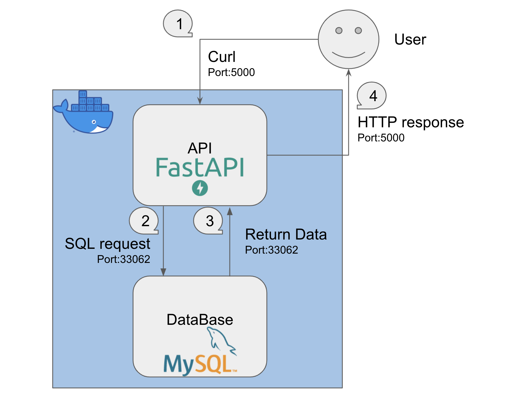

# GTA weekly bonuses

This project is a Docker container with a python FastAPI which returns all of the weekly content available on GTA online

# How to run it?

```bash
docker-compose up
````




# Schema



# Endpoints

## /

Returns all of this weeks bonuses

## /podium

Returns the current car available at the Diamond Casino

## /login

Returns the login bonus of the week (can be only available Amazon Prime)

## /double

Returns all activities with double RP and GTA$

## /triple

Returns all activities with triple RP and GTA$

## /discounts/cars

Returns all the cars at a discount price and it's price

## /discounts/properties

Returns all the properties at a discount price and it's price
